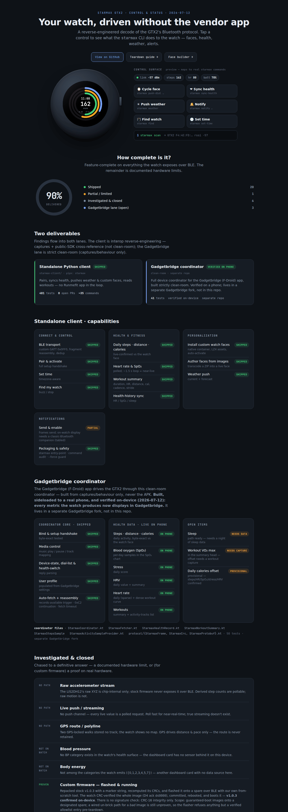
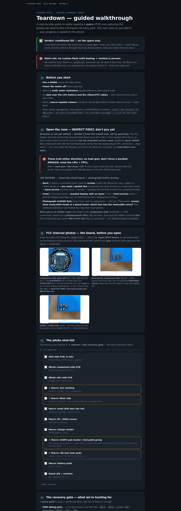

# Starmax GTX2 — BLE client & Home Assistant integration


**Drive the Starmax GTX2 smartwatch with no vendor app and no cloud account.** This is a
reverse-engineering of the GTX2's Bluetooth-LE protocol (vendor app "Runmefit"; sold
rebranded as Wesocfit and others), turned into two things you can run today:

- a **standalone Python client** — `starmax` — that pairs, syncs health, pushes weather, and
  installs custom watch faces straight from Linux; and
- a **Home Assistant integration** (`custom_components/gtx2` + ESPHome gateway nodes + packages)
  that turns the watch into HA sensors and a full control surface — room-aware, over your existing
  Bluetooth proxies, with **no adapter on the HAOS host**.

Both lanes speak the watch's own **`0x0FF0` / C1 protocol** — bind, framing, CRC, and protobuf
payloads reverse-engineered from captured traffic and the watch's own behaviour, never the vendor's
cloud. (On provenance: this repo is honest interop RE, not "clean-room" — see
[Privacy &amp; provenance](#privacy--provenance).)

<p align="center">
  <a href="https://jphein.github.io/starmax-gtx2/"></a>
  <br><em>The live status &amp; control dashboard — <a href="#live-pages">open it on GitHub&nbsp;Pages</a> or from disk.</em>
</p>

---

## Table of contents

- [Live pages](#live-pages)
- [What works](#what-works)
- [Investigated &amp; closed](#investigated--closed)
- [Two ways to drive it](#two-ways-to-drive-it)
  - [1. The standalone `starmax` client](#1-the-standalone-starmax-client)
  - [2. The Home Assistant integration](#2-the-home-assistant-integration)
- [Watch faces](#watch-faces)
- [Protocol &amp; hardware](#protocol--hardware)
- [Docs](#docs)
- [Repo layout](#repo-layout)
- [Privacy &amp; provenance](#privacy--provenance)
- [Credits](#credits) · [License](#license)

---

## Live pages

Three self-contained pages ship in `docs/` and publish to **GitHub Pages** — open them live, or
straight from disk (no server, no CDN, no external fonts; dark & light themes follow your system).

| Page | Live | From disk |
|---|---|---|
| **Status &amp; control dashboard** | <https://jphein.github.io/starmax-gtx2/> | `xdg-open docs/index.html` |
| **Teardown walkthrough** | <https://jphein.github.io/starmax-gtx2/teardown.html> | `xdg-open docs/teardown.html` |
| **Watch-face builder** | <https://jphein.github.io/starmax-gtx2/gtx2-face-builder.html> | `xdg-open docs/gtx2-face-builder.html` |

The **dashboard** is a live-rendered GTX2 (a canvas watch cycling real faces + activity rings)
wired to a control surface that maps each button to a real `starmax` command — plus a capability
matrix, the investigated-&-closed findings, and compact protocol + hardware panels. It's the visual
companion to this README, everything here rendered.

The **teardown walkthrough** is a step-by-step guide to safely opening a *spare* GTX2 and finding a
firmware-recovery path: a safety verdict, an inspect-first open method, a tickable photo shot-list
(saved in your browser), the recovery-pad hunt (SWD / UART / external SPI-NOR), and a staged
recovery sequence. Chip references throughout.

<p align="center">
  <a href="https://jphein.github.io/starmax-gtx2/teardown.html"></a>
</p>

The **watch-face builder** is an interactive field reference for the native dial container — place
clock digits, a hero value, weekday and battery fields and see the layout table update.

---

## What works

Everything the watch exposes over BLE is decoded and driveable from the standalone `starmax`
client. The same decode has been independently **hardware-verified on a phone** through a clean-room
Gadgetbridge coordinator (see [below](#a-third-lane-gadgetbridge)) — ✅-marked rows are confirmed
against the watch's own screen or a second implementation.

| Capability | `starmax` CLI | Notes |
|---|:---:|---|
| Bind · activate · set-time | ✅ | full vendor setup handshake replayed |
| Daily **steps / distance / calories** | ✅ | category 5; step total live-matched the watch face |
| **Heart rate** (daily + workout curve) | ✅ | category 0 — sparse resting + dense workout HR |
| **SpO₂** (blood oxygen) | ✅ | category 2 |
| **Stress** | ✅ | category 1 |
| **HRV** | ✅ | category 7 |
| **Workouts** (summary + HR trail) | ✅ | category 4, KLV record |
| **Health-history sync** | ✅ | `0x0e` per-category poll |
| **Weather push** | ✅ | `0x12`; the watch's weather widget shows the pushed hi/lo |
| **Custom watch faces** (build + install) | ✅ | transcode a ZIP → native container → `dial-push`, auto-activate |
| Find / buzz the watch | ✅ | `0x18` |
| Notifications (`0x11`/`0x13`) | ⚠️ | frame is byte-correct, but **display needs a classic-BT companion** — see below |

**Category map** (the watch's `syncType` enum): `0`=HR · `1`=stress · `2`=SpO₂ · `3`=sleep ·
`4`=workout · `5`=activity · `7`=HRV. Full per-metric decode:
[`docs/health-metrics.md`](docs/health-metrics.md).

**In Home Assistant** the ESPHome gateway node surfaces heart-rate, SpO₂, steps, distance and
calories as sensors, plus device firmware / active-face / connected state and link RSSI — and
exposes the **safe command set** (find/buzz, set-time, weather, alarms, dial-list/switch, push
text, push face) as `gtx2.*` services. The **danger tier** (flash-firmware, DND, media, camera,
call) is deliberately *not* wired to the node — same accidental-brick guard as the host bridge.

---

## Investigated &amp; closed

These were chased to a **definitive answer** — conclusions, not open gaps. The watch simply does not
expose them:

- **No GPS route / polyline.** Workouts store distance & pace only; two GPS-locked walks produced no
  track and the watch shows no map. The route is never retained.
- **No raw accelerometer over BLE.** The LIS2DH12's XYZ is chip-internal; stock firmware never puts
  it on the wire. (Reading it would need custom firmware — see the reopened teardown/CFW track.)
- **No live streaming.** Every live value is a *polled* request; there is no push/stream channel for
  sensor data. (The only watch-originated pushes are the `0x10` media / find-phone control channel.)
- **No blood pressure, no body energy.** Neither is in the watch's health-category set
  (`{0,1,2,3,4,5,7}`) — no sensor / source exists on this device.
- **Notifications need a classic-BT companion.** The `0x11`/`0x13` frames are byte-perfect, but on an
  LE-only link the watch shows *"enable in app"* — display is gated on a connected classic-Bluetooth
  companion (HFP), which an LE-only host can't be. Tracked; tabled. See
  [`docs/notifications.md`](docs/notifications.md).

---

## Two ways to drive it

The watch can be driven from a terminal or from Home Assistant — both are in this repo and both
speak the same decoded protocol.

### 1. The standalone `starmax` client

```bash
cd client
pipx install .                 # installs the `starmax` command (+ '.[transcode]' for dial authoring)
```

> **Linux/BlueZ:** force the adapter **LE-only** first (`ControllerMode = le`, or
> `sudo btmgmt bredr off`) — the GTX2 is dual-mode and BlueZ otherwise grabs the classic transport
> and the `0x0FF0` command service goes missing. Details in
> [`client/README.md`](client/README.md).

```bash
starmax scan                                   # find the GTX2-**** watch
starmax pair --address <MAC>                   # bind + print the device descriptor
starmax activate                               # full setup handshake (enables features)
starmax sync-health                            # pull HR / SpO₂ / steps / sleep / workouts …
starmax weather --temp 22 --condition 6        # push weather (shows on the watch)
starmax dial-build myface.zip myface.bin       # transcode a dial ZIP → native container
starmax dial-push myface.bin                   # install a custom watch face + auto-activate
starmax commands --list                        # every command, grouped, with a sample frame
```

No Home Assistant required. Full command reference:
[`client/docs/command-reference.md`](client/docs/command-reference.md).

### 2. The Home Assistant integration

The HA lane is HACS-shaped and has three cooperating parts, all in this repo:

- **`custom_components/gtx2/`** — the integration ("**GTX2 Watch**"): config flow, health sensors,
  device state, and 21 `gtx2.*` control services (the host bridge owns face-push and the one
  notification path a proxy can't do).
- **`esphome/`** — an **ESP32-C3 gateway node** (`gtx2_client` external component) that holds the
  GATT link, polls health → sensors, and fires `esphome.gtx2_input` for the watch's LE buttons so
  automations can bind them. The node *is* the room — the production path for driving the watch.
- **`packages/`** + **`dashboards/`** — ready-made automations and a Lovelace dashboard.

**Install with HACS** (recommended — you get update notifications):

[](https://my.home-assistant.io/redirect/hacs_repository/?owner=jphein&repository=starmax-gtx2&category=integration)

…or manually in HACS: **⋮ → Custom repositories** → paste `https://github.com/jphein/starmax-gtx2`
(category *Integration*) → install **GTX2 Watch** → restart HA.

**Without HACS** (stock HA has no repo-based install — copy one folder):

```bash
cd /config/custom_components   # your HA config dir
git clone --depth 1 https://github.com/jphein/starmax-gtx2 /tmp/gtx2 && cp -r /tmp/gtx2/custom_components/gtx2 .
```
…then restart HA.

Either way, finish with **Settings → Devices & Services → Add Integration → GTX2 Watch** — the watch
is discovered over Bluetooth via your proxies / gateway node.

**Requires** at least one [ESPHome Bluetooth proxy](https://esphome.io/components/bluetooth_proxy/)
(or a flashed `gtx2-node` from [`esphome/`](esphome/)) within BLE range of the watch.

**The automations & dashboard.** Copy the `packages/gtx2_*.yaml` you want into your HA
`config/packages/` directory (enable with `homeassistant: packages: !include_dir_named packages` in
`configuration.yaml`); each file's header documents the entities it expects.

| Package | What it adds |
|---|---|
| `packages/gtx2_watch.yaml` | core watch entities / helpers |
| `packages/gtx2_lights.yaml` | watch LE buttons → room lights (the "node is the room" pattern) |
| `packages/gtx2_gridkw_live.yaml` | pushes a live number (e.g. grid kW) onto a value-driven face |
| `packages/gtx2_compat.yaml` | compatibility shims for older HA setups |
| `packages/ble_proxy_nodes.yaml` | liveness sensors for your BLE proxy / gateway nodes |

Import `dashboards/gtx2-dashboard.yaml` (with `gtx2-dashboard-core.yaml`) and swap any external
sensor references for your own — they're marked *adapt to your setup*.

### A third lane: Gadgetbridge

A **Gadgetbridge coordinator** also makes the GTX2 a first-class Gadgetbridge device —
hardware-verified on a phone. That lane is built **strictly clean-room** (captures + observed
behaviour only, never the APK/SDK), lives in a separate Gadgetbridge fork, and is **not included in
this repo**.

> **Coexistence:** the GTX2 is a **single-owner** peripheral — while a phone holds it, it stops
> advertising. A phone app and a Linux/HA host **time-share** the watch; disconnect one before
> using the other.

---

## Watch faces

Pre-built dials ship in `watchfaces/*.bin` (with `.png` previews) and under `watchfaces/custom/`.
Build or repack your own with the scripts in `watchfaces/scripts/`
(`dial_create.py` / `dial_pack.py` / `dial_unpack.py`) or interactively in the
[watch-face builder page](https://jphein.github.io/starmax-gtx2/gtx2-face-builder.html); the
`starmax` CLI installs them (`dial-build` → `dial-push`). Rendering needs Python + Pillow; fonts are
resolved via `$GTX2_FONT_DIR`, then `$PATH`, then repo-relative. See
[`watchfaces/README.md`](watchfaces/README.md) and
[`docs/watchface-format.md`](docs/watchface-format.md) for the container format and
[`docs/dial-bindings.md`](docs/dial-bindings.md) for the value-driven field bindings.

---

## Protocol &amp; hardware

**Transport** — a **custom GATT command service `0x0FF0`** (`00000ff0-…`), **not** Nordic UART.
App→watch = write char `0x0001`; watch→app = notify char `0x0002`. The vendor SDK advertises
NUS-style UUIDs, but the firmware exposes `0x0FF0` instead.

**Framing** — `0xC1 | seq | dir | 0x01 | flag | opcode | LEN(16-bit LE) | 00 00 00 | protobuf`,
with a trailing **CRC-16/CCITT-FALSE** (LE) on watch→app protobuf frames. `0xC3` = continuation
fragment; `0xD2` = separate bulk plane (firmware + watch-face blobs).

| Opcode | Dir | Purpose |
|---|---|---|
| `0x01` | W+N | bind / device info |
| `0x02` | W | set time (tz-aware) |
| `0x03` | W | user profile + goals |
| `0x04` | W | feature / notification enable bitmap |
| `0x0e` | W+N | health switches (flag 0) · **history sync** (flag 1) |
| `0x11` / `0x13` | W | notification (detailed / summary) |
| `0x12` | W | weather push |
| `0x16` | W+N | watch-face / resource list |
| `0x18` | W | find / buzz |
| `0xD2` | bulk | firmware + watch-face transfer |

Full reference: [`docs/protocol-spec.md`](docs/protocol-spec.md) · health decode:
[`docs/health-metrics.md`](docs/health-metrics.md) · transport & CRC notes:
[`docs/decode-notes.md`](docs/decode-notes.md).

**Hardware** — Actions **ATS3085(S4)** "Leopard" (Cortex-**M33**, BT 5.3), **XT25F128F** 16 MB
SPI-NOR, **WTM2101** RISC-V AI co-processor (its own firmware), **UC6228CI** GNSS receiver (the chip
the BLE bind reports as "chipset"), sensor stack **LIS2DH12** (accel) · **HX3918** (HR/SpO₂) ·
**QMC6308** (mag) · **SPL07-003** (baro), 466×466 MIPI-DSI AMOLED, ~390 mAh LiPo. Runs Zephyr + LVGL.
Chip IDs from the FCC internal photos and the BLE bind descriptor. Teardown:
[`docs/hardware-teardown-guide.md`](docs/hardware-teardown-guide.md).

---

## Docs

| Doc | What |
|---|---|
| [`docs/protocol-spec.md`](docs/protocol-spec.md) | Full opcode / message / framing reference (**source of truth**) |
| [`docs/health-metrics.md`](docs/health-metrics.md) | Category map, per-metric decode, availability verdicts |
| [`docs/decode-notes.md`](docs/decode-notes.md) | Transport, CRC, envelope decode notes |
| [`docs/watchface-format.md`](docs/watchface-format.md) · [`watchface-install.md`](docs/watchface-install.md) | Custom watch-face container + install |
| [`docs/dial-bindings.md`](docs/dial-bindings.md) | Value-driven dial field bindings |
| [`docs/hardware-teardown-guide.md`](docs/hardware-teardown-guide.md) | Silicon, board, teardown shot-list |
| [`docs/workout-gps.md`](docs/workout-gps.md) · [`notifications.md`](docs/notifications.md) | The two closed investigations |
| [`docs/capture-guide.md`](docs/capture-guide.md) | How the BLE captures were taken |
| [`client/docs/command-reference.md`](client/docs/command-reference.md) | Every `starmax` command with a sample frame |

---

## Repo layout

```
README.md  LICENSE  hacs.json  pytest.ini  requirements-dev.txt
custom_components/gtx2/   HACS-installable Home Assistant integration ("GTX2 Watch")
client/                   standalone `starmax` Python client + CLI (pipx-installable) + tests
esphome/                  ESP32-C3 gateway firmware + gtx2_client external component
packages/                 HA packages: gtx2_watch / gtx2_lights / gtx2_gridkw_live / gtx2_compat / ble_proxy_nodes
dashboards/               the GTX2 Lovelace dashboard(s)
watchfaces/               GTX2 dials (.bin + .png) + custom/ + dial pack/unpack scripts
tests/                    offline integration tests (HA integration + packages)
docs/                     GitHub Pages site (dashboard + teardown + face builder) + protocol / hardware notes + img/
```

---

## Testing

```bash
pip install -r requirements-dev.txt
pytest                     # offline integration tests (tests/)
cd client && pytest        # standalone client suite
```

Both suites are fully offline — no BLE, no Home Assistant, no watch required — and run on **synthetic,
PII-free** frame vectors. Current counts: **489** client tests + **159** integration tests.

---

## Privacy &amp; provenance

- **No captures, firmware, or bug-report dumps are committed.** Raw btsnoop logs and recovered OTA
  images stay local-only — they contain real personal data (notification text, account info, watch
  MAC, biometrics). Sanitize before attaching anything to a public issue/PR.
- Committed tests use **synthetic / PII-free** vectors only; example addresses are placeholders
  (e.g. `F4:4E:FD:11:22:33`) and example rooms/entities are generic — adapt them to your setup.
- **Provenance — two lanes, stated honestly:**
  - The **standalone client** in this repo is **interop reverse-engineering, not clean-room.** It was
    built from our own BLE captures + observed behaviour, **cross-referenced against the public
    [RunmefitSDKDemo](https://github.com/developersth/RunmefitSDKDemo) and analysis of the vendor
    app's own protocol**. Some payload layouts are named from that protocol schema. RE for
    interoperability, MIT-licensed.
  - The separate **Gadgetbridge coordinator** lane (not in this repo) is the one held to a **strict
    clean-room bar** — captures + observed behaviour only, never the APK/SDK — because upstream
    Gadgetbridge requires it.
  - The shipped protocol, health, hardware and teardown **docs** are reconstructed from captured
    traffic, observed behaviour, and FCC-public photos.

---

## Credits

- **[Gadgetbridge](https://gadgetbridge.org/)** — the coordinator framework the (separate,
  clean-room) GTX2/Runmefit support targets (greenfield; no prior Starmax support existed).
- The watch-face container work builds on the broader Da-Fit / Actions dial-format community
  reverse-engineering.

## License

MIT — see [LICENSE](LICENSE). Copyright © JP Hein (jphein).
